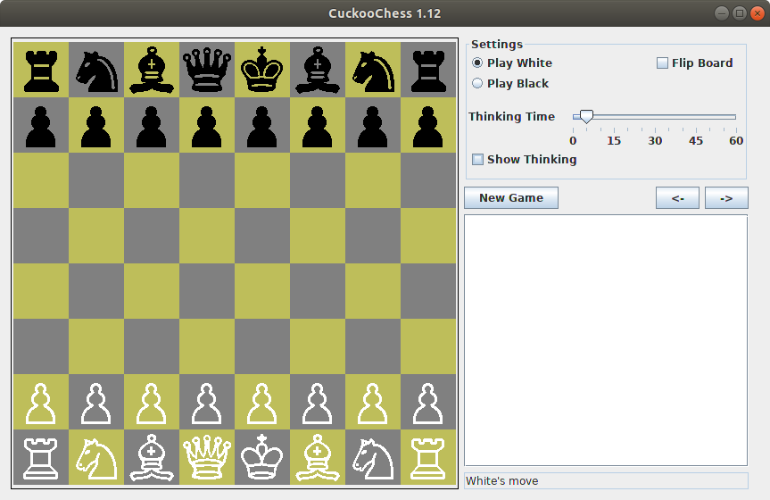
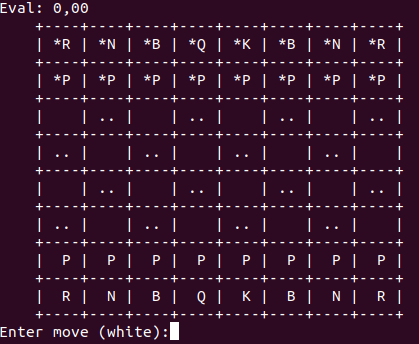

# ChuckooChess 1.12

This is an adaptation of Peter Österlund's CuckooChess 1.12, see [official page](http://hem.bredband.net/petero2b/javachess/index.html).

The source code provided is a Java Maven project in UTF-8.

The program, except for the chess font, is copyrighted by Peter Österlund, and is available as [open source](http://www.opensource.org/) under the [GNU GPL v3 license](http://www.gnu.org/licenses/gpl.html).

## About the program

Most of the ideas in the program are from the [Chess Programming Wiki](http://chessprogramming.wikispaces.com/) or from the [TalkChess.com](http://talkchess.com/forum/) forum.

The program implements many of the standard methods for computer chess programs, such as iterative deepening, negascout, aspiration windows, quiescence search with SEE pruning and MVV/LVA move ordering, hash table, history heuristic, recursive null moves, futility pruning, late move reductions, opening book and magic bitboards.

The program is rather slow compared to state of the art chess programs. However, it is still quite good at tactics and scores [299](http://hem.bredband.net/petero2b/javachess/wac_10s.txt) of 300 on the [win at chess](http://chessprogramming.wikispaces.com/Test-Positions) tactical test suite, at 10 seconds thinking time per position, using an Intel Core i7 870 CPU. The only position not solved is the extremely complicated position 230, which according to [current analysis](http://rybkaforum.net/cgi-bin/rybkaforum/topic_show.pl?tid=18403), seems like a draw and therefore an invalid test position.

Note that the author does not consider Java the best language for implementing a chess engine. He wrote this program mostly to get some hands-on experience with Java and [Eclipse](http://www.eclipse.org/).

The program uses the [Chess Cases](http://www.chessvariants.org/d.font/) chess font, created by Matthieu Leschemelle.

The author picked the name CuckooChess because the transposition table is based on [Cuckoo hashing](http://en.wikipedia.org/wiki/Cuckoo_hashing).

## Downloads

You can also run the applet as a standalone program. Download the [cuckoo-app-1.12-jar-with-dependencies.jar](https://github.com/sauce-code/cuckoo/releases/download/1.12/cuckoo-app-1.12-jar-with-dependencies.jar) file and run it like this (graphical mode):

    java -jar cuckoo-app-1.12-jar-with-dependencies.jar gui

    
Or like this (text mode):

    java -jar cuckoo-app-1.12-jar-with-dependencies.jar txt

More commands are available in text mode than in graphical mode. Try the `help` command for a list of available commands.

## Build instructions

Compile the project using:

    mvn install

You can find the compiled standalone JAR here:

    cuckoo-app/target/cuckoo-app-1.12-jar-with-dependencies.jar

To run it, see description above.

You can also find GUI only, TUI only and UCI only versions here:

    cuckoo-gui/target/cuckoo-gui-1.12-jar-with-dependencies.jar
    cuckoo-tui/target/cuckoo-tui-1.12-jar-with-dependencies.jar
    cuckoo-uci/target/cuckoo-uci-1.12-jar-with-dependencies.jar

For those, you don't need to add any parameters to run them.

## UCI mode

It is also possible to use the program as a [UCI engine](http://en.wikipedia.org/wiki/Universal_Chess_Interface), which means that you can use it with many graphical chess programs. For example, to use it with XBoard/WinBoard + polyglot, set EngineCommand like this in the polyglot ini file:

    EngineCommand = java -jar path/to/jar/cuckoo-app-1.12-jar-with-dependencies.jar uci

To use the program with the [Arena](http://www.playwitharena.com/) GUI, create a one-line bat-file containing:

    javaw -Xmx256m -jar cuckoo-app-1.12-jar-with-dependencies.jar uci

Note that you must set the maximum heap size using `-Xmx` to a value larger than the hash size you set in the Arena program (the author doesn't know exactly how much larger).

If you are using Windows, you may also be interested in a compiled version available from Jim Ablett's [chess projects page](http://jim-ablett.co.de/).

## Speed

The program runs fastest when run in a 64-bit OS using a 64-bit Java implementation (JVM). Here is a speed comparison using CuckooChess 1.11 in 64-bit Windows 7 on an Intel core i7 870, when analyzing from the initial position to depth 17:

| Version               | Speed (N/s) |
| --------------------- | ----------: |
| 64-bit JVM (1.6.0_29) |   1,130,275 |
| 32-bit JVM (1.6.0_29) |     584,194 |

On this computer, the 64-bit version is more than 90% faster. 

## Changelog

You can find the changelog [here](CHANGELOG.md).
